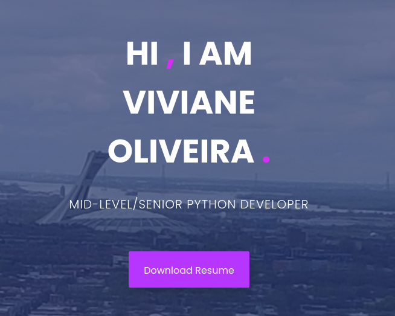

-----------------------
# README
-----------------------
# My resume

It is my online resume and include my job history, education, contact and relevant skills.

##### Main page with a picture from Montreal, that it is my dream city.

# Access - My Resume

It is possible to access my online resume through the link bellow:

Website - https://vivialves.github.io

-----------------------
Template Info:
-----------------------
Browny is a one page bootstrap 3 based resume/portfolio template.

Name: 		Browny - Free Bootstrap One Page Portfolio Resume Template
Version: 	1.0
Author: 	ThemeSINE
Website: 	https://www.themesine.com/

Changelog:
-----------------------
Version 1.0 14-05-2018
- initial release 

Credits:
-----------------------
- Twitter Bootstrap http://getbootstrap.com
- jQuery http://jquery.org
- Modernizr https://modernizr.com/
- Sticky.js http://stickyjs.com/
- JQuery easing https://github.com/gdsmith/jquery.easing
- Bootsnav http://bootsnav.danurstrap.com/
- Pexels https://www.pexels.com/
- Unsplash https://unsplash.com/

License:
-----------------------
This template is under Free License - https://www.themesine.com/license/